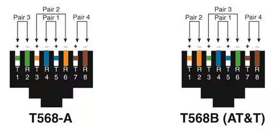

# Home 'Cat-5' RJ45 Cable Wiring Notes  

## RJ45 ethernet connection pinouts:  

Connect your computer to your router or your switch using a straight-through cable. I have read that EIA/TIA T568B is the most popular standard used for straight-through LAN cables.  

There are two main standards for attaching connectors onto *[Cat-5](https://en.wikipedia.org/wiki/Category_5_cable) [RJ45](https://en.wikipedia.org/wiki/Modular_connector#8P8C) cable wiring*: EIA/TIA 568A and EIA/TIA 568B. Both are correct. In the context of straight-through cables, use either of the [EIA/TIA 568](https://en.wikipedia.org/wiki/ANSI/TIA-568) A or B standards consistently throughout any given installation. *Note, you may see what most of us know as RJ45 jacks called "[8P8C modular connectors](https://en.wikipedia.org/wiki/Modular_connector#Standardization)," which is used in many formal standards* and may be more 'correct' than the more generic RJ45.  As far as I know, both names describe the same product, and I will continue using the term RJ45.  

*Cat-5 RJ45 Ethernet cabling* has 8 color coded wires. In the EIA/TIA 568 A or B specifications, they are twisted into 4 pairs of wires. For any given RJ45 connector, a given cable pair is used for pins 1 and 2; another for pins 3 and 6, another for pins 4 and 5, and another for pins 7 and 8.  The difference between EIA/TIA 568A and EIA/TIA 568B standards is that they specify the colors to use for each of those pairs.  

Here is an illustration of a straight-through Ethernet cable:
  
From: <a href="https://www.makeuseof.com/cat-5e-wiring-diagram/">"Cabling Your Home Network? Here’s a Helpful Cat 5e Wiring Diagram" 
By Arjun Vishnu, 2023-06-03</a>  

Using the same EIA/TIA 568B color scheme, here is an illustration of how the Ethernet communicating pairs are numbered:  
   
The key, though, is to crimp your RJ45 connector onto your *Cat-5* cable with the colored wires in the correct relationship with the others.  At higher speeds/throughputs, you may also need to add [shields/hoods/strain-relief](https://assets.rs-online.com/f_auto,q_auto,c_scale,w_400/70641364.jpg) to your cable ends as well.  
  

### Installing RJ45 Connectors onto Cat 5/5e/6 Cable  
See the IDEAL company directions sheet at: https://www.elliottelectric.com/Media/30496-IDE-2  
See a basic demonstration on How to Terminate Ethernet Cables: https://www.youtube.com/watch?v=2OLeNqsNATQ  
See a demonstration using RJ45 Pass Through Connectors: https://www.youtube.com/watch?v=NWhoJp8UQpo  

### EIA/TIA 568-A Ethernet UTP cable wiring diagram  

|Pin |Signal |Description |Wire color |Pin |
|:--:|:-----:|:----------:|:---------:|:--:|
| 1 |TX+ pair 2 |Transmit Data+ |White with green strip  |1 |
| 2 |TX- pair 2 |Transmit Data- |Green with white stripe or solid green |2 |
| 3 |RX+ pair 3 |Receive Data+ |White with orange stripe |3 |
| 4 |BI+ pair 1 |Bi-directional+ |Blue with white stripe or solid blue |4 |
| 5 |BI- pair 1 |Bi-directional- |White with blue stripe |5 |
| 6 |RX- pair 3 |Receive Data- |Orange with white stripe or solid orange |6 |
| 7 |BI+ pair 4 |Bi-directional+ |White with brown strip |7 |
| 8 |BI- pair 4 |Bi-directional- |Brown with white stripe or solid brown |8 |

### EIA/TIA 568-B Ethernet UTP cable wiring diagram  

|Pin |Signal |Description |Wire color |Pin |
|:--:|:-----:|:----------:|:---------:|:--:|
| 1 |TX+ pair 2 |Transmit Data+ |White with orange stripe |1 |
| 2 |TX- pair 2 |Transmit Data- |Orange with white stripe or solid orange |2 |
| 3 |RX+ pair 3 |Receive Data+ |White with green stripe |3 |
| 4 |BI+ pair 1 |Bi-directional+ |Blue with white stripe or solid blue |4 |
| 5 |BI- pair 1 |Bi-directional- |White with blue stripe |5 |
| 6 |RX- pair 3 |Receive Data- |Green with white stripe or solid |6 |
| 7 |BI+ pair 4 |Bi-directional+ |White with brown strip |7 |
| 8 |BI- pair 4 |Bi-directional- |Brown with white stripe or solid brown |8 |

### Do I Care About the Differences in Cat-5, Cat-5e, Cat-6, or Other Twisted Pair *Standards* for Home Ethernet Wiring?  
If you are connecting a couple devices and the cable lengths will be less than 165 feet (50 meters) then, probably not too much, but get Cat-5e certified cable as it effectively replaced Cat-5 years ago.  If your cable runs are between 165 and 325 feet (100 meters), then pay more attention to the fine points of your cable specification as well as the specs of your Ethernet endpoints.  Some people (*including sales-people*) speak of *standard* 100 meter cable length support without consideration of the actual cable in question.  Use some caution if purchasing twisted pair cabling for runs longer than 165 feet (50 meters).  

Category 5 cable, commonly known as *Cat-5*, is an unshielded twisted pair cable type designed for high signal integrity and has been used for Ethernet network infrastructure since at least the early 1990s.  Unshielded twisted pair cables depend on the quality of the twists to protect from [eletromagnetic interference](https://en.wikipedia.org/wiki/Electromagnetic_interference) or [crosstalk](https://en.wikipedia.org/wiki/Crosstalk).  The *Category 5* standards have evolved over time and changes they specify support higher speed communications -- for example [Category 5e](https://en.wikipedia.org/wiki/Category_5_cable#Variants_and_comparisons).  If you know you will be *living with* your cabling for a long time (*possibly decades*) you may want to use cabling certified as [Category 6](https://en.wikipedia.org/wiki/Category_6_cable) -- which, with careful and consistent installation practices, should support much higher data communications throughputs -- to minimize the possibility of having to replace your cabling infrastructure in the future.  

In a home Ethernet implementation there are some other issues that may matter a lot.  Will your cabling be exposed to UV light (*for example, sunlight*), or high heat in an attic or other high-temp location, or strong radio frequency (RF) energy?  Issues like those may force the use of cable products having specialized capabilities (*as opposed to the first spool available*) -- like *plenum-grade*, low smoke cable jackets, UV-resistant cable jackets, shielded twisted pair bundles, or some other required feature(s).  

### Caution about Copper Clad Aluminum (CCA) Cables  
There is some writing about legal actions related to the use of Copper Clad Aluminum (CCA) cables.  Based on my reading, I believe that your Ethernet cabling should be manufactured of 100% copper conductors if reliability is your highest priority.  There appear to be options that are constructed with aluminum, steel, or other less expensive metal.  At 100MB or multi-GB throughputs you will be exercising the full *Cat-5/Cat-6* specification, so to me it seems like an unreasonable risk to use them.  See Fluke's application note "[Copper Clad Aluminum (CCA) Cables](https://www.flukenetworks.com/content/application-note-copper-clad-aluminum-cables)." for more information on this topic.  
