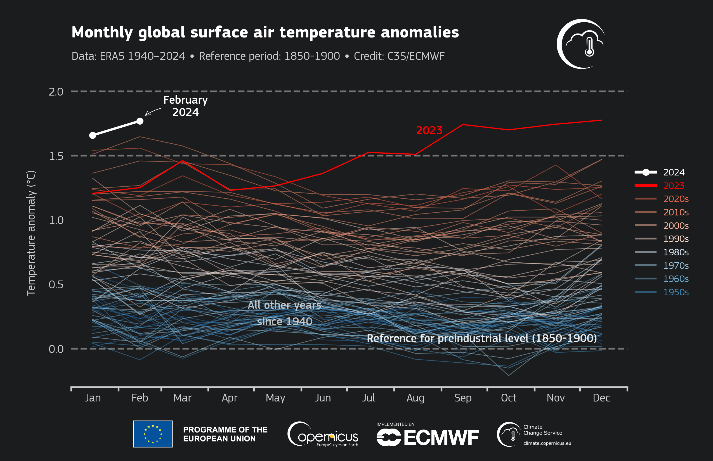
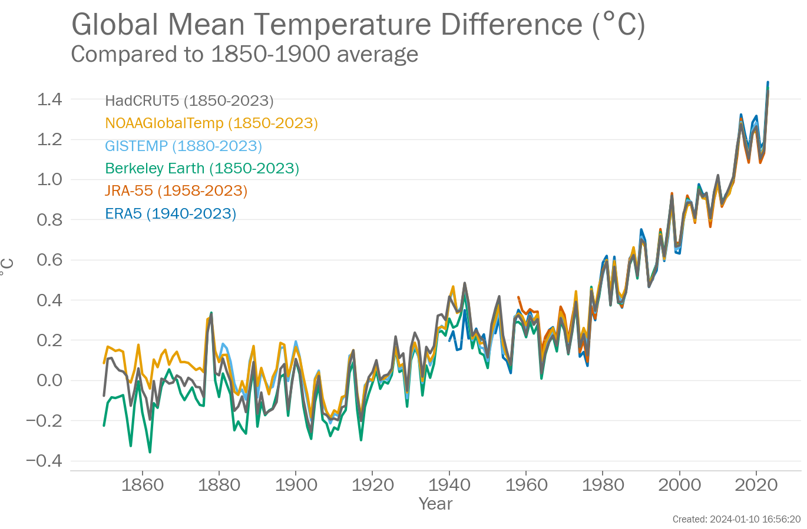

# Climate Change Reading:  

### Climate Change and Global Warming was a Topic for Serious Sciences More than 40 Years Ago  
In 1980, I ran across a used pamphlet - ["Worldwatch Paper 21: Soft Technologies, Hard Choices" by Colin Norman](https://files.eric.ed.gov/fulltext/ED156566.pdf), published a couple years earlier in June 1978.  I was in college at the time and understood that its content was important, and kept that little booklet -- reading it again from time to time.  It was written when our nation still quaked from what Norman called "the Arab oil embargo" and its demonstration of how fragil were the industrial world's petroleum-based economies.  Part of his argument was that humanity needed to implement major energy conservation and to invent/implement new energy generation & transmission technologies to avoid a predicted carbon dioxide-induced global warming catastrophy.  On page 31 Mr. Norman began an explanation of the growing concern "that carbon dioxode -- an inevitable by-product of burning fossil fuels -- is building up in the atmosphere and acting rather like a greenhouse, preventing a fraction of the earth's heat from being radiated into space."  He went on, "The concentration of carbon dioxide in the atmosphere is already (*as he wrote those words in 1978!*) believed to have risen by about 13 percent since the Industrial Revolution, and it may double over the next 50 years.  Such a change could increase the average temperatures on the earth's surface by 2-3 degrees C." He then summarized the predicted impacts "In general, global warming would bring increased rainfall and probably cause local weather patterns to become more variable."  And then:  
>A more worrying possibility is that global warming could have an adverse impact on the stability of the polar ice caps. ...(*and*) over the next 50 years could raise polar temperatures by an amount sufficient to cause the West Antarctic ice sheet to break up.  Such an event would raise the average sea level by about five meters, which would be catastrophic for many low-lying areas.  

Sea ice covered 26.8 million kilometers² when I originally read that pamphlet in 1980 and covers no more than 21.1 million kilometers² as I write this sentence in 2023 (*a reduction of roughly 21%*) and its lowest level in the satellite record (using data from the [National Snow and Ice Data Center](https://nsidc.org/data/seaice_index)).  It is also [hotter](https://climate.copernicus.eu/surface-air-temperature-september-2023)...  The global average temperature for November 2022 to October 2023 was at least 1.32 degrees Celsius above a pre-industrial baseline, [Climate Central reported 8 Nov 2023](https://www.climatecentral.org/climate-matters/earths-hottest-12-month-streak-2023).  

By March 2024 [Copernicus](https://climate.copernicus.eu/warmest-february-record-9th-consecutive-warmest-month) reported that "February 2024 was the warmest February in the ERA5 data record, going back to 1940." and "Every month since last June was the warmest compared to the same month in the series."  
>The month (*February*) was **1.77°C warmer** than the estimated average for February for the period 1850-1900, the designated pre-industrial reference period. The global-mean temperature for the last twelve months was the highest on record at 0.68°C above the 1991-2020 average and **1.56°C above the 1850-1900 pre-industrial average**.  

<a href="https://climate.copernicus.eu/warmest-february-record-9th-consecutive-warmest-month"></a>  
Source: [Copernicus, the European Union's Earth Observation Programme](https://climate.copernicus.eu/warmest-february-record-9th-consecutive-warmest-month): `Monthly global surface air temperature anomalies (°C) relative to 1991–2020 from January 1940 to February 2024, plotted as time series for each year. 2024 is shown with a white line, 2023 with a red line, and all other years with thin lines shaded according to the decade, from blue (1940s) to brick red (2020s). Data source: ERA5. Credit: C3S/ECMWF.`  

[Carlo Buontempo, Director of the C3S said](https://climate.copernicus.eu/warmest-february-record-9th-consecutive-warmest-month): "As remarkable as this might appear, it is not really surprising as the continuous warming of the climate system inevitably leads to new temperature extremes. The climate responds to the actual concentrations of greenhouse gases in the atmosphere so, **unless we manage to stabilise those, we will inevitably face new global temperature records and their consequences**."  

This "*ancient history*" only represents carbon-driven climate warming activity at a given point in `my` lifetime.  [Thomas Alex recently reminded](https://www.desmoinesregister.com/story/opinion/columnists/iowa-view/2023/12/07/climate-change-warnings-greta-thunberg-carl-sagan-al-gore/71829461007/) me that before my grandparents were born, [Svante Arrhenius](https://en.wikipedia.org/wiki/Svante_Arrhenius) (1859-1927), who won the Nobel Prize in 1903, used the principles of physical chemistry to estimate the extent to which increases in the atmospheric carbon dioxide were responsible for the Earth's increasing surface temperature.  Scientific investigation of human-driven climate change has been around for more than a century -- with serious and sustained scientific focus for more than half a century.  Resist the people and organizations who still market climate denial, disinformation, and deception campaigns against climate action (*Jessica Guynn reported in early 2024 that the owners of Twitter/X, Facebook and TikTok have de-emphasized the importance of resisting climate denial, disinformation, and deception across their social media ecosystems, and [their behaviors have resulted in material increases in climate misinformation](https://www.usatoday.com/story/tech/news/2024/01/19/climate-change-denial-spreading-social-media/72257689007/)*).  


The [Paris Agreement](https://en.wikipedia.org/wiki/Paris_Agreement) on climate change set a goal of limiting the long-term temperature increase (averaged over decades rather than any individual year) to a mean of no more than **1.5° Celsius (2.7 °F) above pre-industrial levels** -- reasoning that this would materially reduce the risks and impacts of climate change. Achieving that goal required/requires that humankind materially reduce the emission of greenhouse gases, foster climate resilience and low greenhouse gas emissions development, and support broadly-sustainable development.  

That 1.5° C threshold can be used to build a coarse-grained or macro measure demonstrating alignment (or not) with Paris Agreement goals.  Included below are a number of graphs showing periodic global temperature data -- which can be used to *imagine* near-term trends (*which appear to help illustrate the crisis nature of climate change challenges*).  
>(There are other useful macro measures.) "Long-term monitoring of global temperatures is just one indicator of climate and how it is changing. Other key indicators include atmospheric greenhouse gas concentrations, ocean heat and acidification, sea level, sea ice extent and glacier mass balance." [WMO](https://wmo.int/news/media-centre/wmo-confirms-2023-smashes-global-temperature-record)  

Since the 1980s (*all my adult life*), each decade has been warmer than the previous one. Recently, the ```rate``` of temperature rise has been increasing (*not good*):  

### Monthly Mean Global Temperature Increase From 1940 To 2023 Compared To The 1850 To 1900 Average  
Six leading international datasets used for monitoring global temperatures and consolidated by WMO show that the annual average global temperature was 1.45 ± 0.12 °C above pre-industrial levels (1850-1900) in 2023.  
<a href="https://wmo.int/news/media-centre/wmo-confirms-2023-smashes-global-temperature-record"></a>  

**Image Source**: World Meteorological Organization (WMO) "WMO confirms that 2023 smashes global temperature record Press Release, 12 January 2024](https://wmo.int/news/media-centre/wmo-confirms-2023-smashes-global-temperature-record)" (*downloaded 2024-03-20*).  

### Daily Average Global Temperature Increase From 1940 To 2023 Relative To Pre-Industrial Levels  
Here is a another view, focussing on the last ~80 years of that data (*since 1940*):  
<a href="https://www.swissre.com/institute/research/topics-and-risk-dialogues/climate-and-natural-catastrophe-risk/changing-climates-heat-is-still-on.html"></a>  

**Image Source**: Swiss RE "[Changing climates: the heat is still on](https://www.swissre.com/institute/research/topics-and-risk-dialogues/climate-and-natural-catastrophe-risk/changing-climates-heat-is-still-on.html)" (*downloaded 2024-03-20*)  


### Monthly Mean Global Temperature Difference Compared To 1850 To 1900 The Average  
<a href="https://www.abc.net.au/news/2024-03-20/wmo-climate-records-broken-global-temperature/103604076?utm_campaign=abc_news_web&utm_content=link&utm_medium=content_shared&utm_source=abc_news_web"></a>  

**Image Source**: ABC News Australia "[The World Meteorological Organization's State of the Global Climate report confirms 2023 broke every single climate indicator](https://www.abc.net.au/news/2024-03-20/wmo-climate-records-broken-global-temperature/103604076?utm_campaign=abc_news_web&utm_content=link&utm_medium=content_shared&utm_source=abc_news_web)" By Jess Davis,  2024-03-20  


### Daily Mean Sea Surface Temperature" Rising Faster  
<a href="https://www.abc.net.au/news/2024-03-20/wmo-climate-records-broken-global-temperature/103604076"></a>  

**Image Source**: ABC News Australia "[The World Meteorological Organization's State of the Global Climate report confirms 2023 broke every single climate indicator](https://www.abc.net.au/news/2024-03-20/wmo-climate-records-broken-global-temperature/103604076?utm_campaign=abc_news_web&utm_content=link&utm_medium=content_shared&utm_source=abc_news_web)" By Jess Davis,  2024-03-20  


### Human-Driven Warming is Here Now, and Needs Our Attention  
A key message of the 5th Annual U.S. National Climate Assessment [released on November  14, 2023](https://nca2023.globalchange.gov/) is that future climate change impacts depend on choices made today:  
>The effects of human-caused climate change are already far-reaching and worsening across every region of the United States. Rapidly reducing greenhouse gas emissions can limit future warming and associated increases in many risks. Across the country, efforts to adapt to climate change and reduce emissions have expanded since 2018, and US emissions have fallen since peaking in 2007. However, without deeper cuts in global net greenhouse gas emissions and accelerated adaptation efforts, severe climate risks to the United States will continue to grow.  

The "[National Climate Assessment](https://nca2023.globalchange.gov/chapter/front-matter/)" is a report on climate change impacts, risks, and responses. It is a [congressionally mandated](https://www.congress.gov/bill/101st-congress/senate-bill/169/text) U.S. government interagency effort that provides the scientific foundation to support informed decision-making across the United States.  

The United Nations Environment Programme "[Emissions Gap Report 2023](https://www.unep.org/resources/emissions-gap-report-2023)"  
>Temperatures hit new highs, yet world fails to cut emissions (again) finds that the world is heading for a temperature rise far above the Paris Agreement goals unless countries deliver more than they have promised. The report is the 14th edition in a series that brings together many of the world’s top climate scientists to look at future trends in greenhouse gas emissions and provide potential solutions to the challenge of global warming.  


Change will not be easy in part because there are [around eight billion humans on Earth today](https://population.un.org/wpp/Graphs/Probabilistic/POP/TOT/900), each needing/consuming resources and generating more or less greenhouse gasses (*this is about twice the world population when I was born, and consumption/carbon emissions are wildly unevenly distributed across this population -- introducing fairness issues as we ask given sub-populations to change*).  
<a href="https://population.un.org/wpp/Graphs/Probabilistic/POP/TOT/900"></a>  
  
**Image Source**:
"World > Probabilistic Projections > Population > Total Population."
United Nations Department of Economic and Social Affairs Population Division. Accessed 2024-01-01:  [https://population.un.org/wpp/Graphs/Probabilistic/POP/TOT/900](https://population.un.org/wpp/Graphs/Probabilistic/POP/TOT/900)  


### Too Many of Us Have Delayed Necessary Change  
We have recently been releasing heat-trapping carbon dioxide (*and other greenhouse gases*) into the atmosphere [faster than at any time in at least the past 50 million years](https://www.nytimes.com/interactive/2022/07/20/opinion/ancient-trees-climate-change.html) resulting in profound climate change.  Based on relatively undiciplined reading, it seems like only the sum of immediate, intense individual and collective action can deflect the current trajectory of increasing global suffering (*or worse*).  

Unfortunately, AP's [Cathy Bussewitz reported recently](https://apnews.com/article/climate-emissions-global-warming-carbon-dioxide-coal-494ef490f16abe381ea2a4107f779670) that we (*humanity*) are not reflecting that urgency:  
>"Communities around the world emitted more carbon dioxide in 2022 than in any other year on records dating to 1900, a result of air travel rebounding from the pandemic and more cities turning to coal as a low-cost source of power.  Emissions of the climate-warming gas that were caused by energy production grew 0.9% to reach 36.8 gigatons in 2022, the International Energy Agency [reported Thursday](https://www.iea.org/reports/co2-emissions-in-2022). (The mass of one gigaton is equivalent to about 10,000 fully loaded aircraft carriers, according to NASA.)"  

* We still burn too much coal in electricity generation.  This is in spite of its outsized cost -- [Cecilia Garzella reported that](https://www.usatoday.com/story/news/investigations/2024/05/21/epa-power-plant-rule-coal-shrinking-pollution-map/73558130007/):  
>"The cost of generating (*electric power with*) coal is more than twice that of wind and nearly double that of solar, based on an analysis by the financial advisory firm Lazard, factoring in expenses for building, operating, fueling and maintaining a power plant, even without government subsidies."  
  * Coal consumption for electricity generation in the United States from 1950 to 2023 (in million short tons)  https://www.statista.com/statistics/184333/coal-energy-consumption-in-the-us/  
  * Number of operational coal-fired power plants in the United States as of 2023, by state https://www.statista.com/statistics/1252352/us-coal-power-plants-by-state/  
  * Coal power in the United States https://en.wikipedia.org/wiki/Coal_power_in_the_United_States  
  * Net summer capacity of utility-scale coal-fired power plants in the United States as of 2023, by state (in megawatts) https://www.statista.com/statistics/1252480/us-coal-power-capacity-by-state/  (*Iowa is #15*)  
* Dr. Zeke Hausfather (climate research lead at the payments company Stripe and a research scientist at [Berkeley Earth](https://berkeleyearth.org/), an independent organization that analyzes environmental data) argues in October 2023 that data continues to show the rate of climate warming continues to accellerate: [https://www.nytimes.com/2023/10/13/opinion/climate-change-excessive-heat-2023.html](https://www.nytimes.com/2023/10/13/opinion/climate-change-excessive-heat-2023.html), supported by Robert Rohde's report at: [https://berkeleyearth.org/september-2023-temperature-update/](https://berkeleyearth.org/september-2023-temperature-update/)  
As an overview, see their ["Global Mean Temperature" diagram](https://berkeleyearth.org/wp-content/uploads/2023/10/Seasonal-Sep2023.png):  
<a href="https://berkeleyearth.org/wp-content/uploads/2023/10/Seasonal-Sep2023.png"></a> 
* See the most up-to-date physical understanding of the climate system and climate change - latest data and interpretations: [https://www.ipcc.ch/report/ar6/wg1/](https://www.ipcc.ch/report/ar6/wg1/)  
 * The latest *Synthesis Report* and supporting research from the Intergovernmental Panel on Climate Change (IPCC) will dribble out throughout 2022 [https://www.ipcc.ch/ar6-syr/](https://www.ipcc.ch/ar6-syr/)  Since the IPCC was created in 1988, there have been 5 Synthesis Reports, see links to that historical reporting on this page as well.  
* Or, if that is too much detail, see *the same* message in xkcd format [https://xkcd.com/1732/](https://xkcd.com/1732/)  
* New research can help you better understand climate-related risks at your home or where you work.  FloodFactor will help you understand the current and future flood risks at any North American address: [https://www.floodfactor.com/](https://www.floodfactor.com/)  
* "[World Energy Transitions Outlook: 1.5°C Pathway.](https://www.irena.org/publications/2022/Mar/World-Energy-Transitions-Outlook-2022)" (*34.7&#x2070;F*) from the [International Renewable Energy Agency](https://en.wikipedia.org/wiki/International_Renewable_Energy_Agency) [IRENA].  This second edition of the Outlook outlines priority areas and actions based on available technologies that must be realised by 2030 to achieve net zero emissions by mid-century. March 2022 [https://www.irena.org/publications/2022/Mar/World-Energy-Transitions-Outlook-2022](https://www.irena.org/publications/2022/Mar/World-Energy-Transitions-Outlook-2022)  
* IRENA also has a collection of resources on this topic at: [https://www.irena.org/publications](https://www.irena.org/publications)  
* Articles and Essays about Climate Change from The Electric Typewriter
  * [https://tetw.org/Climate_Change_](https://tetw.org/Climate_Change_)  
  * [https://tetw.org/post/187643116262/10-essential-reads-about-climate-change](https://tetw.org/post/187643116262/10-essential-reads-about-climate-change)  
  * [https://tetw.org/post/152696180408/10-amazing-articles-about-climate-change](https://tetw.org/post/152696180408/10-amazing-articles-about-climate-change)  
* The European [Copernicus Program](https://www.copernicus.eu/) is the European Union's Earth observation program maintains the Copernicus Climate Change Service:  [https://climate.copernicus.eu/](https://climate.copernicus.eu/)  
* Earth, Atmospheric, and Planetary Sciences articles at the Proceedings of the National Academy of Sciences (PNAS), the official journal of the National Academy of Sciences (NAS) (some resources are open access): [https://www.pnas.org/doi/10.1073/pnas.1906691116](https://www.pnas.org/doi/10.1073/pnas.1906691116) and more broadly [https://www.pnas.org/doi/10.1073/pnas.1906691116](https://www.pnas.org/doi/10.1073/pnas.1906691116) [*Resources tagged "Open Access" are available at no cost*] and the completely "open access" [PNAS Nexus](https://academic.oup.com/pnasnexus/issue), starting with [https://academic.oup.com/pnasnexus/article/1/1/pgac009/6540642](https://academic.oup.com/pnasnexus/article/1/1/pgac009/6540642)  
* NASA on Climate Change [https://climate.nasa.gov/](https://climate.nasa.gov/)  
* Science News on Climate Change [https://www.sciencenews.org/topic/climate](https://www.sciencenews.org/topic/climate)  
* Science Daily on Climate Change [https://www.sciencedaily.com/news/earth_climate/climate/](https://www.sciencedaily.com/news/earth_climate/climate/)  
* Union of Concerned Scientists on Climate Change
[https://www.ucsusa.org/climate/science](https://www.ucsusa.org/climate/science) and [https://www.ucsusa.org/climate](https://www.ucsusa.org/climate)  
* Notable Historical Articles:  
  * ["Worldwatch Paper 21: Soft Technologies, Hard Choices.](https://files.eric.ed.gov/fulltext/ED156566.pdf)" by Colin Norman, Worldwatch Paper 21. June 1978.  
  * "[A Historic Look at Climate Change Research -- Plant ecologist Charles F. Cooper wrote prescient and succinct words on the topic of climate change back in 1978.](https://daily.jstor.org/climate-change-research/)"  
    * "[What Might Man-Induced Climate Change Mean?](https://www.foreignaffairs.com/articles/world/1978-04-01/what-might-man-induced-climate-change-mean)" By Charles F. Cooper, Published on April 1, 1978  
  * "[Climatic Change Apocalypse and Law](https://digitalcommons.law.byu.edu/cgi/viewcontent.cgi?article=1103&context=jpl)" By Ray Jay Davis 1995-05-01, Brigham Young University Journal of Public Law. Volume 6, Issue 2.  
  * [Is Beef Really Worse for the Environment Than Driving?](https://daily.jstor.org/are-cows-bad-for-the-envrionment/)  

-------------
### Economic Impacts of Climate Change  
"Atlas of Mortality and Economic Losses from Weather, Climate and Water Extremes (1970–2019)." By the World Meteorological Organization, 2021 (page 8) [WMO-No. 1267](https://library.wmo.int/doc_num.php?explnum_id=10989), published in a number of languages: [https://library.wmo.int/index.php?lvl=notice_display&id=21930](https://library.wmo.int/index.php?lvl=notice_display&id=21930)  
>"According to CRED EM-DAT, from 1970 to 2019 there were 22,326 disasters that met their criteria for recording.  These reported 4,607,671 deaths and US$ 4.92 trillion in economic losses (Figure 1).
>An analysis of the EM-DAT records indicates that 62% of all recorded disasters, 80% of all deaths and almost all (99%) economic losses were associated with natural hazards.  
>Of the 22,326 disasters, 11,072 have been attributed to weather, climate and water hazards. These disasters resulted in 2.06 million deaths and US$3.64 trillion in losses. Thus, over the last 50 years, 50% of all recorded disasters, 45% of related deaths and 74% of related economic losses were due to weather, climate and water hazards."  

[Between 2000 and 2024 the U.S. state of Florida has been struck by at least 79 tropical and subtropical cyclones, their remnants, and their precursors causing more than $236 billion in damage and 615 deaths](https://en.wikipedia.org/wiki/List_of_Florida_hurricanes_(2000%E2%80%93present)).  

#### Top 10 Weather-Related Disasters in the U.S. in the last 50 Years (through 2023)  
[WMO-No. 1267](https://library.wmo.int/doc_num.php?explnum_id=10989) page 41 and NOAA "[Billion-Dollar Weather and Climate Disasters](https://www.ncei.noaa.gov/access/billions/events/US/1980-2024?disasters[]=all-disasters)" and its [CSV data](https://www.ncei.noaa.gov/access/billions/events-US-1980-2024.csv)  
| Name            | Year | Economic losses US$ billion | Deaths |
|-----------------|------|-----------------------------|--------|
| Storm (Katrina) | 2005 | 196.3 | 1,833 |
| Storm (Helene) | 2024 | ???.?? | >200 |
| Storm (Harvey) | 2017 | 156.25 | 89 |
| Storm (Ian) | 2022 | 116.27 | 152 |
| Storm (Maria) | 2017 | 112.5 | 2,981 |
| Storm (Sandy) | 2012 | 86.5 | 159 |
| Storm (Ida) | 2021 | 83.1 | 96 |
| Storm (Irma) | 2017 | 62.5 | 97 |
| Storm (Andrew) | 1992 | 59.1 | 61 |
| Drought/Heat Wave | Summer 1988 | 53.4 | 454 |
| Storm (Milton) | 2024 | 50?? | 16 |
| Midwest Flooding | Summer 1993 | 45.3 | 48 |
| Storm (Ike) | 2008 | 42.3 | 112 |
| Drought/Heat Wave | 2012 | 40.8 | 123 |
| Central/Eastern Drought/Heat Wave | Summer-Fall 1980 | 39.7 | 1,260 |
| Storm (Ivan) | 2004 | 33.2 | 57 |
| Storm (Wilma) | 2005 | 29.5 | 35 |
| Storm (Rita) | 2005 | 28.7 | 119 |
| Storm (Charley) | 2004 | 26.1 | 35 |
| Wildfire | 2019 | 24.46 |  |
| Cold Wave / Winter Storm | Feb 2021 | 24.0 | 226 |
| Western/Central Drought/Heat Wave |2022 | 23.1 | 136 |
| Western Wildfires, Calif. Firestorm | Summer-Fall 2017 | 22.69 | 54 |
| Storm (Hugo) | 1989 | 22.2 | 86 |
| Storm (Frances) | 2004 | 15.9 | 48 |
| Drought | 2002 | 15.7 | 0 |
| Tropical Storm (Allison) | 2001 | 14.7 | 43 |
| Drought | 2012 | 21.79 | ? |
| Southern/Midwestern Drought/Heatwave |Spring-Fall 2023 | 14.5 | 247 |
| East Coast Blizzard and Severe Weather | 1993 | 11.9 | 270 |
| Hurricane Georges | 1998 | 11.3 | 16 |
| South Plains Severe Weather | 1995 | 11.1 | 32 |
| Drought | 2008 | 10.2 | 0 |
| Western Wildfire Season | 2021 | 10.6 | 8 |
| Hurricane Fran | 1996 | 9.8 | 37 |
| Heat Wave & Persistent Western Drought | Jun-Jul 2021 | 8.9 | 229 |
| Central and Eastern Winter Storm and Cold Wave | Dec.2022 | 8.8 | 87 |
| Central and Eastern Tornado & Severe Weather | Mar 31-Apr 1 2023 | 5.7 | 33 |
| Hawaii firestorm | Aug 8, 2023 | 5.6 | 100 |

...and lots more.  For example, In August 2024 [Tyler Jett wrote](https://www.desmoinesregister.com/story/money/business/2024/08/01/imt-insurance-exits-minnesota-raises-deductibles-amid-storm-expenses-sean-kennedy/74617695007/) in the Des Moines Register that [a Midwestern Mutual Insurance company was contracting its business footprint](https://www.youtube.com/watch?v=hwqLZF9DcJE) in an attempt to adapt to increasing property losses:  
>National Oceanic and Atmospheric Administration data showing that 13 storms causing at least $1 billion in damage have hit Minnesota since 2021. In the prior decade, just seven such storms hit Minnesota.  Iowa likewise has recorded 13 billion-dollar storms from 2021 through this year, after just seven such storms in the previous decade, and other Midwestern states have seen a similar trend in the fequency of severe storms.  

United Nations, "Climate and Weather related Disasters Surge Five-fold Over 50 Years, but Early Warnings Save Lives – WMO report," UN News, Sept. 1, 2021  
and  
>"In the 1980s, the country experienced on average a $1billion disaster every four months, adjusted for inflation. It now experiences one every three weeks. This year, the country has set a new record with 25 billion-dollar disasters." FROM: "What makes 2.7 degrees F so crucial? -- As COP28 begins, Earth approaches critical point." By Elizabeth Weise, USA TODAY (in The Des Moines Register, 2023-12-01, page A6. *accessed 2023-12-01*) [https://desmoinesregister-ia.newsmemory.com?selDate=20231201&goTo=A006&artid=0&editionStart=Des%20Moines%20Register](https://desmoinesregister-ia.newsmemory.com?selDate=20231201&goTo=A006&artid=0&editionStart=Des%20Moines%20Register)  

[Since 1980 NOAA has been tracking disasters](https://www.ncei.noaa.gov/access/monitoring/dyk/billions-calculations?itid=lk_inline_enhanced-template) using an range of public and private data including insurance payouts and infrastructure damage to estimate their economic impact.  Listed below are some [summary numbers](https://www.ncei.noaa.gov/access/billions/summary-stats/US/2020) from their data:  
In 2023, the U.S. experienced 28 separate weather and climate disasters costing at least 1 billion dollars, totalling $93.1B and at least 492 deaths. That number puts 2023 into first place for the highest number of billion-dollar disasters in a calendar year.  
In 2022, the U.S. experienced 18 separate weather and climate disasters costing at least 1 billion dollars, totalling $179.1B and at least 474 deaths.  
In 2021, the U.S. experienced 20 separate weather and climate disasters costing at least 1 billion dollars, totalling $160.8B and at least 724 deaths.  
In 2020, the U.S. experienced 22 separate weather and climate disasters costing at least 1 billion dollars, totalling $118.2B and at least 262 deaths.  


* Forest fire management deserves more attention.  Trees in forests store large amounts of carbon that can be released when they burn, adding to climate change.  The [Copernicus Atmosphere Monitoring Service (CAMS) reported](https://atmosphere.copernicus.eu/wildfires-wreaked-havoc-2021-cams-tracked-their-impact) that wildfires last year emitted the equivalent of about 8.2 billion tons of carbon dioxide (*that is the same volume of CO2 emissions from [all energy combustion and industrial processes globally in 1959](https://www.iea.org/data-and-statistics/charts/co2-emissions-from-energy-combustion-and-industrial-processes-1900-2021)*). That is as much as 22% of global CO2 emissions from coal, oil and other energy sources [(36.3 billion tons) recorded in 2021 by the International Energy Agency](https://www.iea.org/reports/global-energy-review-co2-emissions-in-2021-2).

### Top ten countries most exposed to four weather perils as of today  

| Rank | Country | Annual economic loss (% of GDP) |
|------|---------|---------------------------------|
|1 |Philippines |3.00% |
|2 |US |0.38% |
|3 |Thailand |0.36% |
|4 |Austria |0.25% |
|5 |China |0.22% |
|6 |Taiwan |0.21% |
|7 |India |0.20% |
|8 |Australia |0.19% |
|9 |Switzerland |0.19% |
|10 |Japan |0.18% |

Source: Swiss RE Group "[Economic losses set to increase due to climate change, with US and Philippines the hardest hit, Swiss Re Institute finds](https://www.swissre.com/press-release/Economic-losses-set-to-increase-due-to-climate-change-with-US-and-Philippines-the-hardest-hit-Swiss-Re-Institute-finds/3051a9b0-e379-4bcb-990f-3cc8236d55a1)" 2024-02-28  

* "New Google **geothermal** electricity project could be a milestone for clean energy." By Jennifer McDermott, Associated Press. November 28, 2023 [https://apnews.com/article/geothermal-energy-heat-renewable-power...](https://apnews.com/article/geothermal-energy-heat-renewable-power-climate-5c97f86e62263d3a63d7c92c40f1330d)  
* "Solar is now ‘cheapest electricity in history’, confirms IEA." [https://www.carbonbrief.org/solar-is-now-cheapest-elec...](https://www.carbonbrief.org/solar-is-now-cheapest-electricity-in-history-confirms-iea/)  
* [Deloitte on accelerated decarbonization](https://www2.deloitte.com/us/en/pages/about-deloitte/articles/economic-cost-climate-change-turning-point.html):  
  > [Deloitte builds an economic argument](https://www2.deloitte.com/content/dam/Deloitte/us/Documents/about-deloitte/us-the-turning-point-a-new-economic-climate-in-the-united-states-january-2022.pdf) that [even without considering the impacts of water availability, crime/war, or ocean acidification](https://www2.deloitte.com/content/dam/Deloitte/us/Documents/about-deloitte/us-the-turning-point-us-tech-appendix-january-2022.pdf) climate change will result in catastrophic economic impacts over the next 50 years (losses of $14.5 trillion in present-value terms for the U.S.) -- requiring immediate action to decarbonize and build economic resiliance.  
* The U.S. National Mortgage Bankers Association researched climate change risks in their domain: [https://img03.en25.com/Web/MortgageBankersAssociation/Research_RIHA_September_2021_Report.pdf](https://img03.en25.com/Web/MortgageBankersAssociation/%7B66e37863-0f2e-45c7-8526-04d615d395e9%7D_22847_Research_RIHA_September_2021_Report.pdf)  

* The World Economic Forum’s “[Great Reset](https://www.weforum.org/great-reset/)” included discussions about additional/urban planning efforts to fight the climate crisis, including "[15-minute cities](https://www.washingtonpost.com/lifestyle/2023/03/03/15-minute-cities-faq/)."  

"April 2021 -- The economics of climate change: no action not an option." by Swiss Re Institute  [https://www.swissre.com/dam/jcr:e73ee7c3-7f83-4c17-a2b8-8ef23a8d3312/swiss-re-institute-expertise-publication-economics-of-climate-change.pdf](https://www.swissre.com/dam/jcr:e73ee7c3-7f83-4c17-a2b8-8ef23a8d3312/swiss-re-institute-expertise-publication-economics-of-climate-change.pdf)  (*page 3, with supporting variations on pages 4, 11, 12, 15, 28, and 29*)  
>"The world economy could be 10% smaller if the 2050 net-zero emissions and Paris Agreement targets on climate change are not met."  
and  
>"The world stands to lose close to 10% of total economic value by mid-century if climate change stays on the currently-anticipated trajectory"  

"World economy set to lose up to 18% GDP from climate change if no action taken, reveals Swiss Re Institute's stress-test analysis."  22 Apr 2021, Zurich [https://www.swissre.com/media/press-release/nr-20210422-economics-of-climate-change-risks.html](https://www.swissre.com/media/press-release/nr-20210422-economics-of-climate-change-risks.html)  
>"In a severe scenario of a 3.2°C (37.76&#x2070;F) temperature increase, China stands to lose almost one quarter of its GDP (24%) by mid-century. The US, Canada and the UK would all see around a 10% loss. Europe would suffer slightly more (11%), while economies such as Finland or Switzerland are less exposed (6%) than, for example, France or Greece (13%)."  

-------------
### Student Essays on Climate Change  
*  Climate Change Essays on Bartlebys: [https://www.bartleby.com/topics/Essay-on-Climate-Change](https://www.bartleby.com/topics/Essay-on-Climate-Change)  
* Climate Change Reading on CRAM: [https://www.cram.com/subjects/Global-Warming-and-Climate-Change-Essay](https://www.cram.com/subjects/Global-Warming-and-Climate-Change-Essay)  

-------------
### Random Action  

#### Use Only What You Need  
"American consumerism is a personally and environmentally destructive force." (*[Helaine Olen summarizing](https://www.washingtonpost.com/opinions/2022/10/04/vicki-robin-profile-your-money-your-life-anniversary-fire/) some of Viki Robin's teaching*)  Avoiding energy (*or other*) consumption is the best practice.  It can deliver quick results...  
* Andrea Stanley wrote an [interesting essay about light, light pollution, and light tresspassing](https://www.nytimes.com/2022/07/15/realestate/light-pollution-effects.html) where she argued that we use too much light without thinking enough about our intended goals.  She concludes that this results in a broad range of negative impacts -- which include material amounts of wasted energy (*citing a 2022 U.S. DoE report on "[Solid-State Lighting R&D Opportunities](https://www.energy.gov/sites/default/files/2022-02/2022-ssl-rd-opportunities.pdf)"*).  

#### Treat Big Oil and Big Ag Like Big Tobacco  
* Fossil fuel, big ag and their enablers knew years ago that their businesses damaged earth and drove climate change. But they invested heavily in climate denial, disinformation, and deception campaigns against climate action for decades to protect their profits and influence.  Their tactics included counterfeit science, harassment of scientists, manufactured uncertainty with no scientific basis, and influence campaigns aimed at political decision makers and career civil servants.  They left communities to pay the price.  See supporting work by the Union of Concerned Scientists [https://www.ucsusa.org/climate/disinformation](https://www.ucsusa.org/climate/disinformation) and The Center for Climate Integrity [https://climateintegrity.org/](https://climateintegrity.org/).  Here is an illustration of our experience with how fatal and climate-damaging coal-fired electricity generation has been relative to widely available alternatives [https://ourworldindata.org/cheap-renewables-growth](https://ourworldindata.org/cheap-renewables-growth) and the bar chart alone at [https://ourworldindata.org/uploads/2020/11/5-Bar-chart-%E2%80%93-What-is-the-safest-form-of-energy-1536x827.png](https://ourworldindata.org/uploads/2020/11/5-Bar-chart-%E2%80%93-What-is-the-safest-form-of-energy-1536x827.png).  
* See: "Assessing ExxonMobil's global warming projections." in "Science." 13 Jan 2023, Vol 379, Issue 6628 DOI: 10.1126/science.abk006  [https://www.science.org/doi/10.1126/science.abk0063](https://www.science.org/doi/10.1126/science.abk0063) which concludes that [ExxonMobil "knowingly misled" the public and governments -- having company-sponsored science documenting the company's impacts on global warming/climate change yet building and deploying campaigns to generate doubt.  Exxon's position was to "emphasise the uncertainty in scientific conclusions" about the greenhouse effect](https://www.bbc.com/news/science-environment-64241994?s=09).  
>On the basis of company records, we quantitatively evaluated all available global warming projections documented by -- and in many cases modeled by -- Exxon and ExxonMobil Corp scientists between 1977 and 2003. We find that most of their projections accurately forecast warming that is consistent with subsequent observations. Their projections were also consistent with, and at least as skillful as, those of independent academic and government models. Exxon and ExxonMobil Corp also correctly rejected the prospect of a coming ice age, accurately predicted when human-caused global warming would first be detected, and reasonably estimated the "carbon budget" for holding warming below 2°C. On each of these points, however, the company's public statements about climate science contradicted its own scientific data.  
* See: "Big Oil talks 'transition' but perpetuates petroleum, House documents say
A House committee, accusing oil companies of deception, releases a trove of internal documents revealing how these firms view the 'energy transition.'" By [Steven Mufson](https://www.washingtonpost.com/people/steven-mufson/) and [Timothy Puko](https://www.washingtonpost.com/people/timothy-puko/), 2022-12-09 [https://www.washingtonpost.com/climate-environment/2022/12/09/oil-companies-house-documents-climate/](https://www.washingtonpost.com/climate-environment/2022/12/09/oil-companies-house-documents-climate/): ..." the industry is misleading the public by advertising a commitment to cleaner energy even as it disproportionately invests in fossil fuels"  
* Too many U.S. Republicans shill for Big Oil.  For example, the [Conservative Climate Foundation](https://www.rightonclimate.org/) paid for members of the Republican [Conservative Climate Caucus](https://curtis.house.gov/news/documentsingle.aspx?DocumentID=1961) -- U.S. Reps. John Curtis (R-Utah), Garret Graves (R-LA), Dan Crenshaw (R-Texas), and **Mariannette Miller-Meeks (R-Iowa)** -- to [present some of Big Oil's "*clean oil*" stories](https://desmoinesregister-ia.newsmemory.com?selDate=20221113&goTo=A010&artid=0) as a panel at the [COP27 U.N. Climate Summit](https://unfccc.int/COP27), in Sharm el-Sheikh, Egypt, on 2022-11-11.  At the [final scheduled session of the day](https://www.state.gov/u-s-center-at-cop27/schedule-and-events/program/) (4:00-5:00pm local time) these four elected representatives presented "Conservative Solutions to Global Climate Challenges: A Robust U.S. Energy, Climate and Conservation Agenda," moderated by Rich Powell, professional energy adviser to Washington D.C. policymakers, co-chair of the "[Conservative Climate Foundation](https://www.rightonclimate.org/)," CEO of [ClearPath](https://clearpath.org/about-us/rich-powell/) and FoxNews contributor.  They appear focused on *removing roadblocks to extracting, consuming and exporting American oil/natural gas and coal.*  They promoted a range of ideas -- carbon capture being hot in 2022-2023.  They mentioned some *techy* and *sciency* topics, but [their behaviors all seemed to be about increasing earnings/profits through the extraction, consumtion and exporting of American oil/natural gas and to greenwashing biofuel manufacturing](https://www.scientificamerican.com/article/the-false-promise-of-carbon-capture-as-a-climate-solution/) and coal (*with a nod to U.S. ethanol producers via Iowa's Miller-Meeks*).  Sprinkling some legitemately useful energy items did not eliminate the tone of their presentations.  This thread of Big Oil-funded activity only leads to higher levels of CO2 along with greater damage to earth and all who inhabit it.  It also helps to create a fog of ideas that support the status quo and serve to obscure and disrupt efforts to deal with climate change dangers on a relevant time-scale.  
* This is not a new idea:  
  * [Fred Krupp (Environmental Defense Fund) argued in 2014](https://www.edf.org/media/statement-edf-president-fred-krupp-colorado-breaks-new-ground-addressing-oil-and-gas-air) that leakage of methane throughout the natural gas supply chain, including during production activities -- *methane is at least 28 times more powerful than CO2 as a greenhouse gas over the longer term and at least 84 times more potent in the near term* -- along with large-scale volatile organic compound (VOC) emissions make natural gas just as bad an energy source as coal...  
  * Also See: 
    * "[Merchants of Doubt: How a Handful of Scientists Obscured the Truth on Issues from Tobacco Smoke to Climate Change](https://www.amazon.com/Merchants-Doubt-Handful-Scientists-Obscured/dp/1608193942)." By [Naomi Oreskes](https://en.wikipedia.org/wiki/Naomi_Oreskes) and [Erik M. Conway](https://en.wikipedia.org/wiki/Erik_M._Conway), 2010 -- which argues that spreading doubt and confusion is the foundational strategy of Big Oil's efforts opposing actions that might help diminish the negative impacts of human-induced climate change.  
    * "[Against Climate Action: Television Stars -- An industry group is spending millions of dollars to push back against efforts to move heating away from oil and gas.](https://www.nytimes.com/2023/01/11/climate/climate-propane-influence-campaign.html)" By Hiroko Tabuchi. Jan. 11, 2023.  Ms. Hiroki documents how "The Propane Education and Research Council, or PERC, which is funded by propane providers across the country, has spent millions of dollars on "provocative anti-electrification messaging" for TV, print and social media, using influencers." Propane is derived from fossil fuels and emits planet-warming greenhouse gases like its cousins, coal, gasoline or diesel. "In 2023, the organization plans to spend $13 million on its anti-electrification campaign, including $600,000 on "influencers"...in order to "combat the growing narrative that fossil fuel combustion is the main cause of climate change, and that propane is a dirty fossil fuel."  PERC also invests millions of dollars in lobbying against climate legislation -- including with misleading disinformation about the efficiency of heat pumps in Northern climates. "In 2022, for example, PERC committed nearly $900,000 to a New York propane industry group to address the "massive challenge from well-funded efforts to electrify the entire state" — namely, to fight policies stemming from New York's 2019 climate law which, among other goals, aims to ensure that buildings and vehicles stop adding greenhouse gases to the atmosphere by 2040."  
	* "[The False Promise of Carbon Capture as a Climate Solution -- Fossil-fuel companies use captured carbon dioxide to extract more fossil fuels, leading to a net increase in atmospheric CO2.](https://www.scientificamerican.com/article/the-false-promise-of-carbon-capture-as-a-climate-solution/)" by [Naomi Oreskes](https://en.wikipedia.org/wiki/Naomi_Oreskes), 03-01-2024.  
* Ethanol and biodiesel are hard-linked to internal combustion technologies that are concurrently dependent on Big Oil.  They have been marketed as "clean" and "green" for decades despite hard science (*and common sense observation*) showing otherwise.  [Donnell Eller reported recently](https://desmoinesregister-ia.newsmemory.com?selDate=20240616&goTo=A001&artid=0&editionStart=Des%20Moines%20Register) that "despite their claim to produce a green alternative to gasoline, ethanol plants in Iowa and other Midwestern states are releasing large amounts of harmful pollutants... and emit large quantities of greenhouse gases." She was reporting on a report from the [Environmental Integrity Project](https://environmentalintegrity.org/wp-content/uploads/2024/06/Biofuels-report-EMBARGOED-for-6.12.24.pdf) that documented some of the ways that ethanol and biodiesel plants parallel (*and sometimes even exceed*) oil refinery pollution. Using manufacturer's self reporting data Project authors shared that ethanol plants in the U.S. release more "formaldehyde, a carcinogen; acetaldehyde, a probable carcinogen; hexane, which can attack the central nervous system and cause dizziness, nausea and headaches; and acrolein, which can cause nausea, vomiting, and lung and eye irritation" than oil refineries, as well as a much broader stew of unhealthy chemicals and other pollutants.  Biofuel manufacturing plants also released "14,526 tons of nitrogen oxides, 14,782 tons of sulfur dioxide, 7,740 tons of particulate matter (*having a diameter of 10 micrometers or less*), 10,678 tons of carbon monoxide and 240 pounds of lead" in 2020.  The Project also reported](https://environmentalintegrity.org/wp-content/uploads/2024/06/Biofuels-report-EMBARGOED-for-6.12.24.pdf?page=4) that "In terms of climate-warming pollution, biofuel plants in the U.S. reported emitting over 33 million metric tons of greenhouse gases in 2022."  Iowa is [one of the top ethanol plant polluters](https://environmentalintegrity.org/wp-content/uploads/2024/06/Biofuels-report-EMBARGOED-for-6.12.24.pdf?page=15):  
>In Iowa and Illinois, the top two highest corn-producing states in the U.S., about 70 percent of all hazardous pollutants reported came from ethanol plants – a total of 5.7 million pounds in 2022. The hazardous air pollutant totals from ethanol plants in Illinois (2.2 million pounds) and Iowa (3.6 million pounds) were similar to the amount reported by oil refineries in Louisiana (2.7 million pounds) that year. Together, the totals from ethanol plants in these two midwestern states were about the same as the amount of hazardous air pollutants reported by petroleum refineries in Texas (5.8 million pounds in 2022).  
  * Also see: 
	* "[Farm to Fumes -- Hazardous Air Pollution from Biofuel Production](https://environmentalintegrity.org/wp-content/uploads/2024/06/EIP_Report_FarmtoFumes_6.12.24.pdf)." The Environmental Integrity Project, 2024-06-12  
	* "[Flaws in EPA’s Monitoring and Verification of Carbon Capture Projects](https://environmentalintegrity.org/wp-content/uploads/2023/12/EIP_Report_CarbonCapture12.14.23.pdf)." The Environmental Integrity Project, 2023-12-04  
* For some recent CO2 measurement documentation, see: "[Hawaii’s Mauna Loa Observatory just captured ominous signals about the planet’s health -- Carbon dioxide is accumulating in the atmosphere faster than ever](https://www.washingtonpost.com/weather/2024/05/10/carbon-dioxide-record-mauna-loa/)." By Scott Dance
May 10, 2024.  

#### Force More Accurate Pricing for Fossil Fuels and Other Petrochemicals  
* We have been subsidizing the petrochemical industry by allowing them to abondon as many as [3.2 million oil and gas wells](https://pubs.acs.org/doi/10.1021/acs.est.1c02234) after they stop 'producing' enough to meet the industry's short term profit goals.  These sites '*leak*' dangerous substances into the atmosphere, the ground, and water sources -- resulting in enormous negative economic and social impacts.  [Some estimate](https://www.energypolicy.columbia.edu/sites/default/files/file-uploads/OrphanWells_CGEP-Report_071620.pdf) that 3.2 million abondoned wells would emit more than 500,000 metric tons of methane per year.  The U.S. has allowed the petrochemical industry to discount and walk away from their obligation of, the costs of 'cleaning up' millions of oil and gas well sites around the country.  Recently, [the U.S. government (*read, "U.S. tax-payers"*) has begun to fund abondoned well cleanup](https://apnews.com/article/biden-travel-new-orleans-climate-and-environment-bbe808df98e65085eda9018b32cac29a).  Forcing all those involved in the oil and gas location, extraction, production, transmission, and distribution to include the full life-cycle costs of their materials (including cleaning up all oil and gas well sites) would help to more accurately represent the economic load these industry participants (and their investors) impose on us.  It would also help drive more accurate pricing for their products and make 'cleaner' alternatives more attractive.  
* Big Oil and ethanol plant operators (*and unethical investors*) are attempting to build out carbon-capture infrastructure **by tapping into billions of dollars in federal support**. Pipeline companies in the U.S. mid-west want *massive* federal payments available to those who transport carbon dioxide from ethanol, fertilizer and other energy-intensive industries by mixing huge amounts of it with toxic *proprietary* solutions, liquifying it, using high pressure to drive it hundreds or thousands of miles, and then pumping those poisons deep under ground.  To do so they need to build extensive pipeline networks across a number of mid-western and southern states and get permissions to "*store*" the toxic waste underground.  That "*storage*" is a euphemism for [flooding previously-pumped oil/gas fields with the CO2+toxin mixture in order to flush out much of the remaining oil](https://www.scientificamerican.com/article/the-false-promise-of-carbon-capture-as-a-climate-solution/) -- which is sometimes shortened by Big Oil/Big Ag proponents to simply "[enhanced oil recovery](https://www.energy.gov/fecm/enhanced-oil-recovery)."  They preach that this activity has a single-minded focus on contributing to its net-zero emissions goal by 2050 -- for example, review the sessions at the [November 8-9, 2022 National Carbon Capture Conference](https://2022-nccc.bbiconferences.com/ema/DisplayPage.aspx?pageId=Agenda1).  These actors do not appear to invest time/effort into analyzing their efforts in the context of the broader carbon and energy life-cycles.  Their operations enable increasing gas/oil extraction (new carbon) and add **a lot** of energy consumption to every industry process they service and they create new environment-polluting processes and new streams of toxic waste along the way.  The "federal support" and the distribution of new costs across a range of carbon-emitters (*heavy with petrochemicals*) and the state and local governments where they operate appear as *background noise* in promotion of carbon capture concepts and the science and technology deployed in its service.  All of this effort seems like it is in service of Big Oil and the status quo.  
* The Pipeline Safety Trust's "[Regulatory and Knowledge Gaps in the Safe Transportation of Carbon Dioxide by Pipeline](https://pstrust.org/wp-content/uploads/2022/10/CO2-Regulatory-and-Knowledge-Gaps-1.pdf)" document's that this *new* "carbon capture" infrastructure is being built without common-sense safety measures like leak alarms, automatic shutoffs and more.  As a result, when they fail, risks to human and animal life seem unreasonably large.  
* U.S. regulations appear to be written by Big Oil/Big Ag with a goal of maximizing profits. [Pipeline and storage regulation](https://primis-meetings.phmsa.dot.gov/archive/) provide a digestable path into that ecosystem. For example, here are some quotes from a recent Federal Register - [Federal Register / Vol. 88, No. 96 / Thursday, May 18, 2023 / Proposed Rules; page 31891](https://primis-meetings.phmsa.dot.gov/meetings/f64a12c1-01fc-444d-9ffa-d0ea90bc314d/files/feb8a547-ef7b-47df-8116-225938d9a0eb/Leak_Detection_NPRM.pdf) about the Department of Transportation Pipeline and Hazardous Materials Safety Administration (PHMSA) regulations:  
  * "The current pipeline safety regulations do not include any meaningful performance standards for leak detection equipment, nor requirements that leverage the significant advancements in the sensitivity, efficiency, and variety of leak detection technologies in the last five decades."  
  * "...the current pipeline safety regulations do not explicitly require repair of all—or even most—leaks on gas pipeline facilities."  
  * "Leaks that an operator determines do not to present an existing or probable public safety hazard do not need to be repaired at all regardless of the resulting environmental harms posed by that release."  
  * "Current regulations also do not prescribe specific timeframes for the timely repair of hazardous or any other leaks, other than leaks associated with certain metal loss, cracking, and denting defects that are discovered on gas transmission piping during an integrity assessment in accordance with gas transmission integrity management in subpart O of 49 CFR part 192 or § 192.714."  
  * "...current regulations tolerate significant intentional emissions of methane and other gases, even in non-emergency situations, by allowing venting, blowdowns, and other large-volume releases of gas from all PHMSA-jurisdictional pipeline facilities without restriction."  
  * "Consistent with the pipeline safety regulations’ historical lack of emphasis on the environmental consequences of gas releases, PHMSA’s minimum incident reporting threshold was established principally to better reflect the economic consequence of lost gas 2 and was set at 3 million standard cubic feet (MMCF), which leaves many large-volume gas releases unreported."  
  * "PHMSA has no reporting requirements for intentional releases of gas at all."  

#### Call Out Climate Deniers/Skeptics/Provocateurs  
* Invest enough effort in reviewing the outputs of these threads of **doubt-provoking** activity to understand their data selections, logic and conclusions.  (*Examples of this work incorporates `real` facts/observations to give their theories, assertions, and conclusions the ring of objective science*.)  Then if the author's mission appears to be focused on creating "*alternatives*" to broadly-established science, make your observations known in your social and professional circles, and consider writing reviews of the work for publication.  

An example of this category (*alternative* "science") might be the "[Climate Change Reconsidered series](https://climatechangereconsidered.org/climate-change-reconsidered-ii-fossil-fuels/)" outputs from the [Nongovernmental International Panel on Climate Change (NIPCC)](https://climatechangereconsidered.org/about-the-nipcc/) and [The Heartland Institute](https://climateconferences.heartland.org/) which build their narratives & conclusions on "*research overlooked or ignored by*" more objective scientists involved in climate change research.  

#### What can we measure and report that might be immediately relatable to non-scientists?  
Climate deniers/skeptics/provocateurs often use some version of a "word soup" or "acoustic salad" designed and delivered to sow doubt, confusion or concern about messaging from *real* climate scientists and honest climate advocates.  What types of data might be most immediately understandable and relatable to non-scientists?  Here are a few from the [U.S. National Climate Assessment](https://nca2023.globalchange.gov/chapter/front-matter/).  
* Change in Precipitation on the Wettest Day of the Year for a specified geographic area, for a specified geographic area, per unit of time, over time  
* Change in Annual Precipitation for a specified geographic area, per unit of time, over time  
* Change in Average Annual Temperature for a specified geographic area, per unit of time, over time  
* Change in Days with *Extreme Precipitation* for a specified geographic area, per unit of time, over time  
* Change in *Extreme Precipitation* for a specified geographic area, per unit of time, over time  
* Change in Mean Summer Temperature for a specified geographic area, per unit of time, over time  
* Change in Number of Days Over 100 deg F for a specified geographic area, per unit of time, over time  
* Change in Number of Days Over 105 deg F for a specified geographic area, per unit of time, over time  
* Change in Precipitation on the Wettest Day in 5 Years for a specified geographic area, per unit of time, over time  
* Change in Temperature on the Hottest Day of the Year for a specified geographic area, per unit of time, over time  
* Change in the Lowest Average Temperature of Summer for a specified geographic area, per unit of time, over time  
* Change in the Number of Days Below 0 deg F for a specified geographic area, per unit of time, over time  
* Change in the Number of Days Over 95 deg F for a specified geographic area, per unit of time, over time  
* Change in the Number of Nights Over 70 deg F for a specified geographic area, per unit of time, over time  
* Change in the Number of Days Under 32 deg F for a specified geographic area, per unit of time, over time  
* Change in the Number of heat-related hospitalizations for a specified geographic area, per unit of time, over time  
* Change in the Number of heat-related deaths for a specified geographic area, per unit of time, over time  


#### Some Trustworthy Sources of Information  
* World Meteorological Organization "[State of the Global Climate](https://wmo.int/publication-series/state-of-global-climate)" reports  
* The "[National Climate Assessment](https://nca2023.globalchange.gov/chapter/front-matter/)  
* Carbon Brief https://www.carbonbrief.org/analysis-greater-than-99-chance-2023-will-be-hottest-year-on-record/  
* NOAA Physical Sciences Lab https://psl.noaa.gov/research/  
* Copernicus, the European Union's Earth Observation Programme https://climate.copernicus.eu/climate-intelligence  
* (*Maybe*) The [Pipeline Safety Trust](https://pstrust.org/)  
