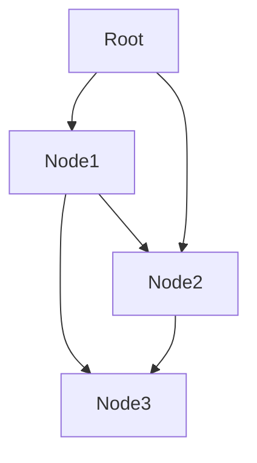

## This is test for github.com support for the "Mermaid" markdown dialect

Here is a Mermaid block:

  
  This is below the Mermaid block.
  
* Mermaid JS [https://github.com/mermaid-js/mermaid/tree/release/8.10.0](https://github.com/mermaid-js/mermaid/tree/release/8.10.0)  
* Mermaid integrations [https://github.com/mermaid-js/mermaid/blob/develop/docs/integrations.md](https://github.com/mermaid-js/mermaid/blob/develop/docs/integrations.md)  
* Mermaid server [https://github.com/TomWright/mermaid-server](https://github.com/TomWright/mermaid-server)  
