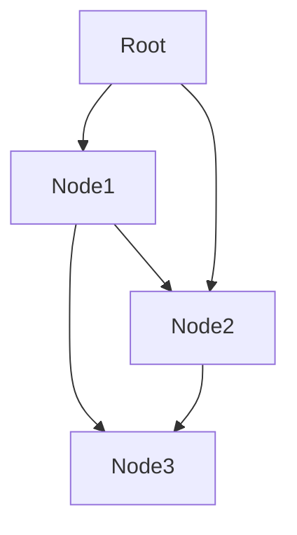

## This is test for github.com support for the "Mermaid" markdown dialect

Here is a Mermaid block:

```mermaid 
graph TD;
  Root-->Node1;
  Node1-->Node3;
  Node1-->Node2;
  Root-->Node2;
  Node2-->Node3;
```
  
  This is below the Mermaid block.
  
