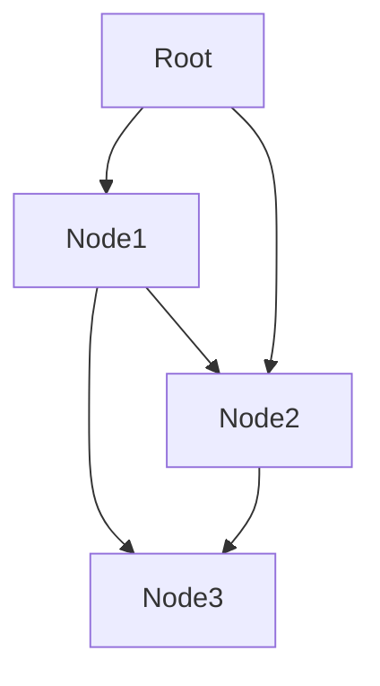

## Use "Mermaid" For Flow Diagrams  

Mermaid is a markdown dialetc and a JavaScript library that is just a fantastic toolkit.  When you host your markdown on github.com it renders well using the approach below.  Anywhere else, markdown is missing support for drawing diagrams. 

Here is a Mermaid block:  

*code*  
```terminal
'''mermaid
graph TD;
  Root-->Node1;
  Node1-->Node3;
  Node1-->Node2;
  Root-->Node2;
  Node2-->Node3;
'''
```

*renders as*  

  
  This is below the Mermaid block.  
  
* Mermaid JS [https://github.com/mermaid-js/mermaid/releases/latest](https://github.com/mermaid-js/mermaid/releases/latest)  
* Mermaid integrations [https://github.com/mermaid-js/mermaid/blob/develop/docs/integrations.md](https://github.com/mermaid-js/mermaid/blob/develop/docs/integrations.md)  
* Mermaid server [https://github.com/TomWright/mermaid-server](https://github.com/TomWright/mermaid-server)  
* Linux Format Article: "[Dynamic diagrams with Mermaid](https://www.pressreader.com/australia/linux-format/20210309/281715502348881)." by Mihalis Tsoukalos - source code available at [https://www.linuxformat.com/archives?issue=274](https://www.linuxformat.com/archives?issue=274)